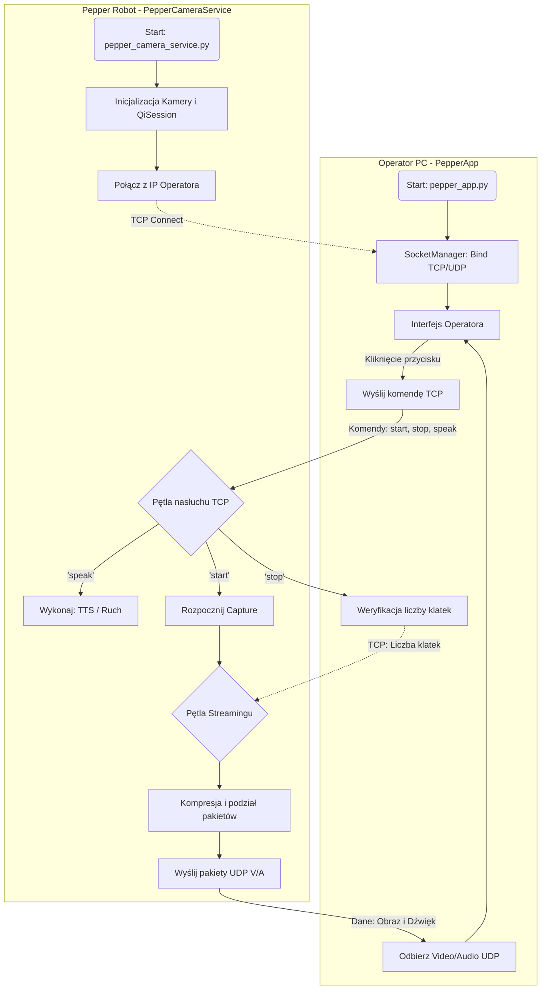

# pepper-WoZ

A Wizard of Oz (WoZ) application for remotely controlling a SoftBank Robotics Pepper robot. It enables high-quality audio/video recording of interactions for research purposes. Works on Pepper robots running NAOqi OS 2.9.x.

## Key Features

-   **Cross-Platform Control**: The `PepperApp` control interface runs on both Windows and Linux.
-   **Real-time Streaming**: Streams video and audio from the robot to the operator's PC.
-   **Remote Operation**: Allows the operator to make the robot speak and perform other actions remotely.
-   **High-Quality Recording**: Captures synchronized audio and video, saving it directly to the operator's machine.

## Architecture

The system is split into two main components that communicate over a network:

-   **`PepperApp`**: A desktop application for the operator (the "wizard"). It provides the user interface to see through the robot's eyes, hear through its microphones, and send commands. It runs on the operator's PC.

-   **`PepperCameraService`**: A service that runs directly on the Pepper robot. It captures video from the camera and audio from the microphones, and listens for commands from `PepperApp`.

Communication is handled via:

-   **TCP**: For reliable transmission of commands (e.g., start/stop recording, speak) and status messages.
-   **UDP**: For low-latency streaming of video and audio data.

## Block diagram

